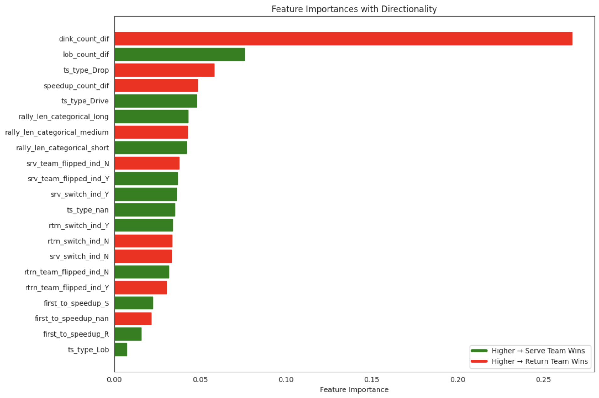

# Pickleball Point Analysis

Caleb Hyun - ckhyun@umich.edu

Maxwell Cooper - maxwcoop@gmail.com

## Introduction

This dataset is a collection of professional pickleball doubles matches found at pklmart.com. We were able to get 2 main dataframes through the use of the pklshop API. One dataframe contained information about 2500+ rallies across different 50 different pickleball matches. The next dataframe contained information about 22,000 shots from these rallies. We combined the results of these two dataframes into a final dataframe.

### Point Analysis

Through the use of this dataframe, we hope to be able to predict the winner of an individual pickleball point through machine learning models based on metrics found in these datasets. 

After we have created a model, we will analyze the classifiers that made up this model, and attempt to identify the most important features of what makes a winning point for each team. Ultimately, we would like to identify what exactly makes up a win in a doubles match to help improve pickleball performance.

The columns we will utilize are as follows:

`w_team_id` - this is the column we are predicting, it is binarized to 1 for the serve team 
      wins the point, 0 for the return team wins
      
`ts_type` - what the third shot type is in the match, this is done by the serving team
      
`rally_len` - the number of shots completed in this individual rally or point
      
`srv_switch_ind`, `rtrn_switch_ind`, `srv_team_flipped_ind`, `rtrn_team_flipped_in` - these 
      columns are binarized talking about different methods of stacking in pickleball, 1 for if 
      they are doing that method of stacking, 0 if not
      
`lob_count_S`, `lob_count_R` - describes how many lobs each team hit in one point, 
      S for Serve, R for Return
      
`serve_dink_count`, `return_dink_count` - describes how many dinks each team hit 
      in one point
      
`speedup_count_S`, `speedup_count_R` - describes how many speedups each team hit 
      in one point, S for Serve, R for Return
      
`first_to_speedup` - describes the first team to speedup the ball in each point, 
      S for Serve, R for Return, or nan for neither team hit a speedup
      
`shot_type_orig` - describes the type of shot hit, utilized for combining the two dataframes 

## Data Cleaning and Exploratory Data Analysis

The pklshop API allowed us to get 2 main datasets. One was a dataset containing rallies indexed by game it occured in. The next was shots indexed by each rally.

We will now combine these datasets into a final dataset of rallies indexed by game. But this dataset would now contain additional information that we got from the shots dataframe.

The specific metrics we pulled are: Serve and Return team Dink Count, Serve and Return team Speedup count, Serve and Return Team lob count, and which team did a speedup first.

### Data Cleaning
First, we have to create a combined_rallies dataset by appending all of the rallies game by game.

Similarly, we accessed the shots rally by rally, to create our final combined_shots dataset: 

      combined_rallies.columns:
            Index(['rally_id', 'match_id', 'game_id', 'rally_nbr', 'srv_team_id',
             'srv_player_id', 'rtrn_team_id', 'rtrn_player_id', 'ts_player_id',
             'ts_type', 'w_team_id', 'to_ind', 'to_team_id', 'rally_len',
             'srv_switch_ind', 'rtrn_switch_ind', 'srv_team_flipped_ind',
             'rtrn_team_flipped_ind', 'ending_type', 'ending_player_id', 'lob_cnt',
             'dink_cnt', 'maint_dtm', 'maint_app', 'create_dtm', 'create_app'],
            dtype='object')
<iframe
  src="assets/combined_shots_table.md"
  width="800"
  height="600"
  frameborder="0"
></iframe>

### Univariate Analysis

<iframe
  src="assets/rally_length_by_end_type.html"
  width="800"
  height="600"
  frameborder="0"
></iframe>

This plot is a collection of 4 box and whisker plots. As we can see from the chart, a majority of the unforced errors, and normal errors occur earlier in a point, typically within 5 or 6 shots. The majority of the winners occur after the 8 or 9 shot mark. This causes us to want to look into the rally length as a distinguishing factor of our eventual model.

Since there are a considerable amount of unforced error points, we will look at removing this column because they are classified as a mistake made by the losing team, not because of the opposing team's effort.

<iframe
  src="assets/shot_type_distribution.html"
  width="800"
  height="600"
  frameborder="0"
></iframe>

From this chart we can examine a number of things. Here are the descriptions and analyses of each category from left to right:
      
`O` - other, and a majority of the shots are uncategorized based on this
`D` - dink, this is to be expected because the sport centers around dinks
`SE` - serves 
`R` - returns
`tsDrp` - number of third shot drives
`tsDrv` - number of third shot drops interestingly enough, the third shot drop is more popular than the drive
`SP` - speed ups
`L` - number of lobs, we expect this, as lobs are not very popular 
`E` - ernies, or shots where a player jumps over the kitchen to hit a volley
`tsL` - number of third shot lobs, where this is clearly a last resort third shot
 `A` - ATP's or around the post shots where the ball doesn't travel over the net

Additionally, we might want to analyze some of these shot types, in terms of whether or not the type of third shot weighs a large part of the winner, or we could want to look at which team hit a speed up shot first during the point.

### Bivariate Analysis
<iframe
  src="assets/rally_length_vs_dink_count.html"
  width="800"
  height="600"
  frameborder="0"
></iframe>

This plot charts the comparison between rally length and dink count, but also includes the type of shot ending it had. From it, we can see that most of the low dink count, low rally length points, ended in errors or unforced errors. As points went longer over 20 rallys with under 15 dinks they started ending with winners or another unspecified type of ending.

## To DO: insert two interesting bivariate analyses

### Interesting Aggregates
In order to create our model, we wanted to break down the number of shots hit by each team, as we originally only had the number of a shot hit during the point.

We created a final analysis dataframe, where along with other columns from the original dataframe, we used the shots dataframe to count the number of dinks, speedups, and lobs that each team hit, along with who was first to speedup.

### Final DataFrame

# insert html here!

These are the first 5 rows of our final dataframe. Some columns to note that weren't referenced earlier are `srv_team_id` and `rally_id`, these columns are just indexes essentially. They helped us match up shot data to be aggregated into the final dataframe. 

This dataframe is what we will be running our models on. We are going to utilize multiple features to predict the outcome of an individual point 

### Imputation
We did not have to impute any values, we ended up not grabbing any rows where there were na values for the rally. The only 'imputation' we did was fill the `first_to_speedup` column with 'NaN' if neither team hit a speedup shot in the rally.

We didn't fill any missing values because we didn't grab them, because we didn't want to predict on made-up data through imputation. We wanted to predict the outcome of points where we had all necessary data present.

## Framing a Prediction Problem
We are going to predict the results of column `Serve_team_won` which is a binary column with 1 for serve team wins, and 0 for return team wins. We are predicting this column because we want to gather what features allow us to actually make the predictions, and what matters the most for the models accuracy. 

This is a binary classification problem, and we are going to utilize the accuracy score to determine how effective our model was. Accuracy will let us understand how accurate our predictions were to the actual result of the point over the span of all of our points. 

On top of this, since we would like to determine what factors make up a winning point, we excluded any row that has an ending classified as an **'Unforced Error'**. This allows us to get more accurate data for a winning point with either a forced error, winner, or other, not a classified mistake by a player.

## Baseline Model

Features: The baseline model uses rally length, serve team dink count (quantitative), and third shot type (nominal).

**Data Transformations:**

Numerical: rally_len and serve_dink_count are scaled with StandardScaler to ensure consistent feature scaling. Categorical: ts_type is one-hot encoded with handle_unknown='ignore', enabling binary representation and handling unseen categories.

**Modeling Steps:**

Train-Test Split: The dataset is split to ensure unbiased performance evaluation on unseen data. 

Pipeline: A ColumnTransformer scales numerical features and encodes categorical ones, feeding transformed data to a LogisticRegression model. The same transformations are applied to the test set during prediction.

**Classification Report:**
      
               precision    recall  f1-score   support
       False       0.61      0.93      0.74       316
        True       0.46      0.09      0.15       208

    accuracy                           0.60       524
 

<iframe
  src="assets/baseline_confusion_matrix.html"
  width="800"
  height="600"
  frameborder="0"
></iframe>

**Evaluation:**

While our Baseline model seemed to have reasonable accuracy, we noticed that the model was picking False much too often, likely because of the fact that the return team has an inherent ~10% advantage starting the point. However, even when the model WAS picking True, it was getting it wrong more than 50% of the time. This can help explain why the f1-score is so low for 'True' predictions. We assessed the performance using a classification report (precision, recall, F1-score) and a confusion matrix.

## Final Model
### Random Forest Classifier

For the final model, we used a **Random Forest Classifier** and improved upon the baseline model by engineering 4 new features and tuning hyperparameters using GridSearchCV.

### **Feature Engineering**
1. **Interaction Features**
   - **`dink_count_dif`:** Difference between serve and return dink counts. This describes the net dominance in dinks.
   - **`speedup_count_dif`:** Difference between serve and return speedups. This describes aggression levels in rallies.
   - **`lob_count_dif`:** Difference between serve and return count of lobs. 

2. **Categorical Transformation**
   - **`rally_len_categorical`:** Converted `rally_len` into short, medium, and long categories, as we believed that once both teams have gotten past a certain number of shots, the inherent advantage the return team has goes away. We then one hot encoded these columns.
   - we used binary encoding for features like `srv_switch_ind`.

### **Modeling Algorithm**
- **Random Forest Classifier**: We chose the Random Forest Classifier for its ability to capture complex feature interactions and handle a mix of numerical and categorical features. We hoped that the Random Forest would inherently be able to better model the complex, non-linear relationships between many of these features than Logistic Regression (for example, dink count vs speedup count).

### **Performance Evaluation**
- **Test Set Results**:
  - **Classification Report**: Our Final model improved precision, recall, and F1-scores compared to the baseline model.
  - **Confusion Matrix**: Most significantly, our model reduced the number of false negatives.

### **Comparison with Baseline**
- The final model outperformed the baseline by capturing nuanced interactions through engineered features and Random Forest hyperparameter tuning.
- Additionally, we saw that, while the model still predicted False too much, it predicted True correctly more often than not as opposed to our Baseline model. Our model seems to be very good at predicting whether the return team wins the point, but not as good at measuring whether the serve team wins the point. 

Classification Report:
               
               precision    recall  f1-score   support
       False       0.67      0.80      0.73       316
        True       0.57      0.41      0.48       208

    accuracy                           0.65       524
<iframe
  src="assets/final_confusion_matrix.html"
  width="800"
  height="600"
  frameborder="0"
></iframe>

### Hyperparameter Analysis
One of our stated goals was to figure out how we could change our game based on the most important hyperparameters to our model. 

## Interesting Insights:

Qualifiers - Our model is not perfect by any means, and this was trained on pro matches, so the takeaways may be different than amateur matches.

**Influence of `ts_type`:**
The model predicts a higher probability of the serving team winning when the shot type is 'Drive' compared to 'Drop' or 'Lob.' However, this reflects a correlation observed in the data and does not necessarily imply causation. For example, we saw that drives are generally hit off of shallower returns. Lobs seem to be the least effective third shot.

NaN being high in this graph makes sense, as when a third shot is not hit, it was likely off of an error in the return.

**Influence of `First to Speed Up`:**
Interestingly, the team to speed up first is strongly predicted to win the point, according to our model.

**Influence of `rally_len_categorical`:**
Something that surprised us was that the length of the category didn't seem to affect the prediction that much. We expected that, since the serving team has a small disadvantage going into the point (.45%), as the point goes on that disadvantage would go away when both teams get to the kitchen line. This was what we saw.

**Stacking:**
None of the stacking variables (srv, rtrn switch) seemed to make much of a difference on the model.

## Conclusion
Pickleball point winners are inherently hard to predict, since it is a binary outcome clouded by hundreds of small choices. Our goal was to find 

Strategy 1: As returning team, first 6 shots should be trying to force an error. Then, cool off during the 6-12 shots, and once the rally is back at equilibrium, look for winners and speedups to catch your opponent off guard.

Strategy 2: Stack away!

Strategy 3: Don't be afraid to look for speedups.

Strategy 4: Drive when you get a weak return. 

Strategy 5: Don't feel forced to dink.

